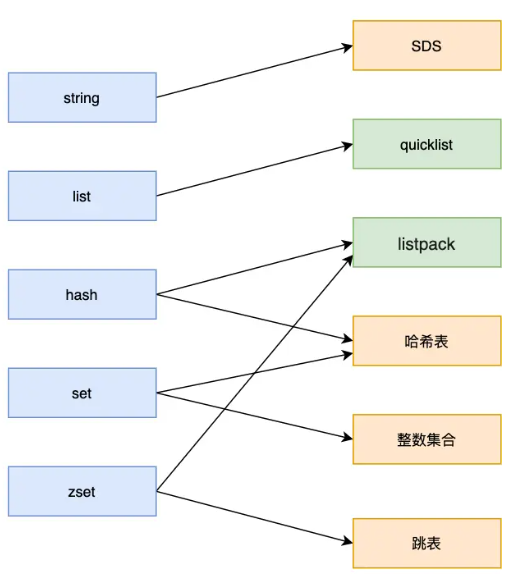

# underlying data structure

> 记录 underlying dataStructure 的结构和知识

**Redis为什么那么快**

1. *Redis* 是内存数据库，不需要进行磁盘IO，查找效率快。
2. *Redis* 使用的数据结构能使我们对数据进行CURD时，*Redis*能更高效的实现。

Redis 数据结构并不是指 String（字符串）对象、List（列表）对象、Hash（哈希）对象、Set（集合）对象和 Zset（有序集合）对象，因为这些是 Redis 键值对中值的数据类型，也就是数据的保存形式，这些对象的底层实现的方式就用到了数据结构。

**键值对数据库是怎么实现的？**
